# Zhangetsu_dos E-commerce product page

## Bienvenidos 👋

le presento mi tienda Zhangetsu

Diseñada por Exequiel Alvarado.

-font awesome

**lo que ocupe --> HTML, CSS, Boostrap, Python, Mysql, Django, and JavaScript,orm laragon.mysql**

## paquetes Instalado
asgiref==3.7.2
async-generator==1.10
attrs==23.1.0
blinker==1.6.2
Brotli==1.0.9
certifi==2023.5.7
cffi==1.15.1
charset-normalizer==3.1.0
click==8.1.3
colorama==0.4.6
distlib==0.3.6
Django==4.2.2
exceptiongroup==1.1.1
filelock==3.12.0
Flask==2.3.2
Flask-Cors==3.0.10
h11==0.14.0
idna==3.4
itsdangerous==2.1.2
Jinja2==3.1.2
MarkupSafe==2.1.2
mutagen==1.46.0
mysql==0.0.3
mysql-connector-python==8.0.33
mysqlclient==2.2.0
outcome==1.2.0
Pillow==9.5.0
platformdirs==3.5.1
protobuf==3.20.3
pycparser==2.21
pycryptodomex==3.18.0
PySocks==1.7.1
requests==2.31.0
selenium==4.10.0
six==1.16.0
sniffio==1.3.0
sortedcontainers==2.4.0
sqlparse==0.4.4
trio==0.22.0
trio-websocket==0.10.3
tzdata==2023.3
urllib3==2.0.3
virtualenv==20.23.0
websockets==11.0.3
Werkzeug==2.3.4
wsproto==1.2.0
yt-dlp==2023.3.4

##  Mi Perfil en githud @exequiel-alvarado  

## diseño de la principal
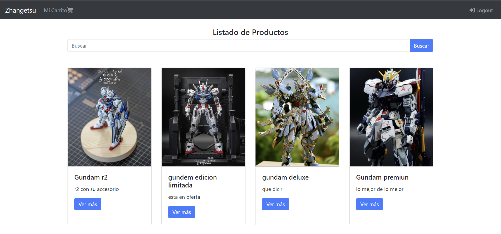

## diseño de registro
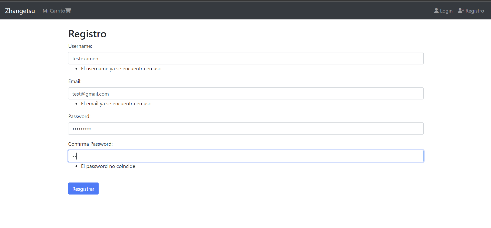
## diseño de login
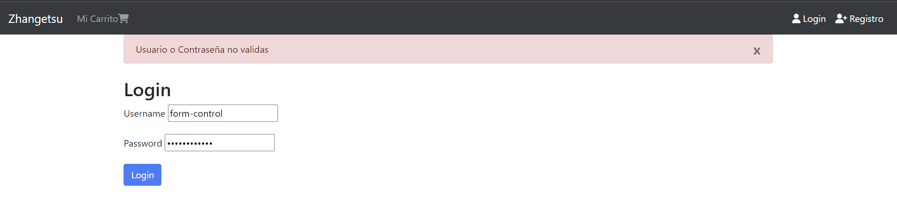
## diseño de logeando

## diseño de selecionar
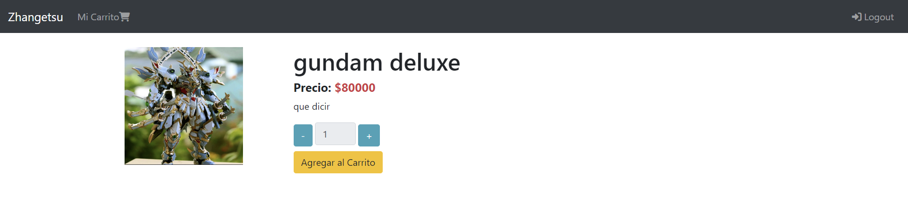
## diseño de cantidades
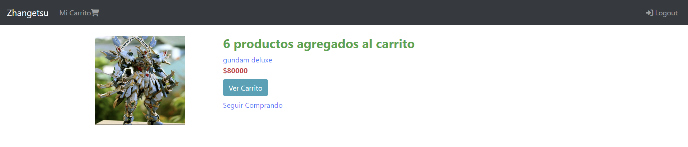
## diseño de carrito vacio
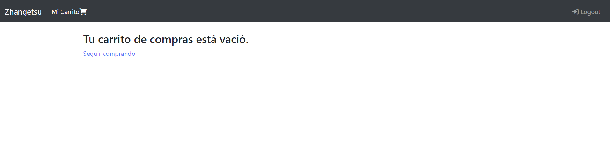
## diseño de producto pre orden
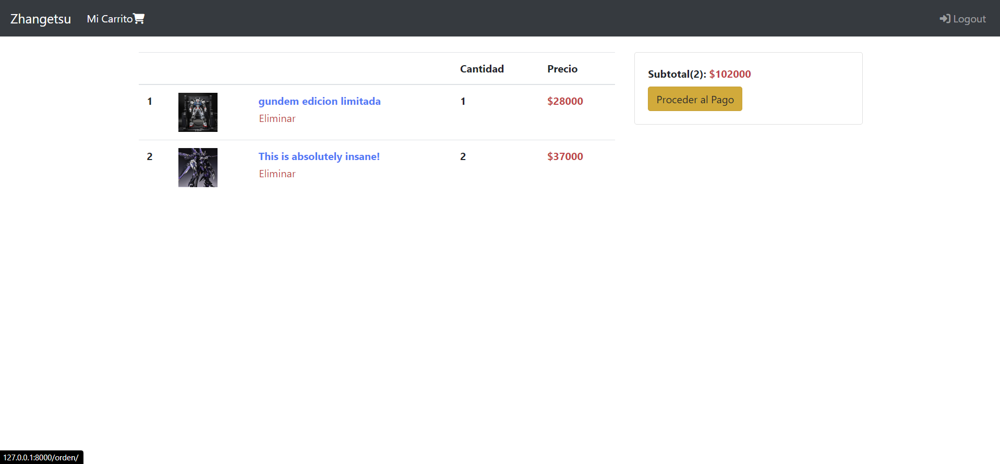
## diseño pago
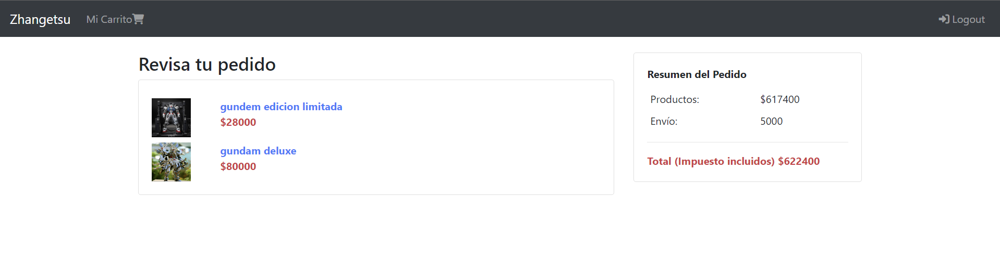
## diseño productos

## orm laragon
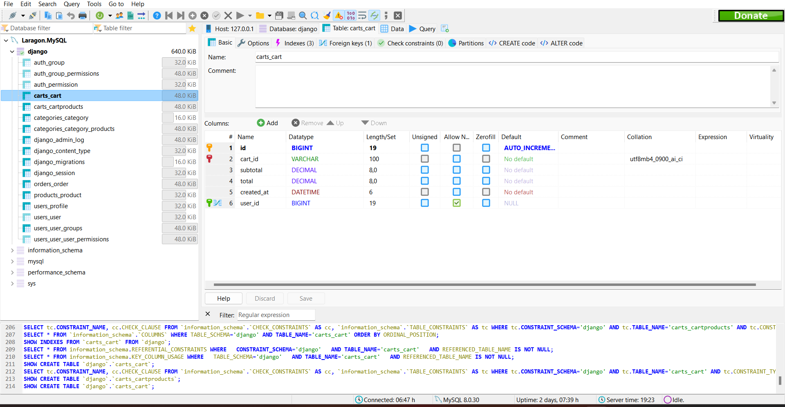
## orm conexion
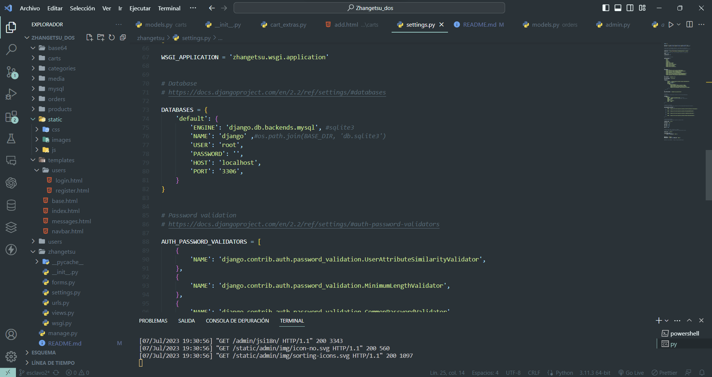
## models
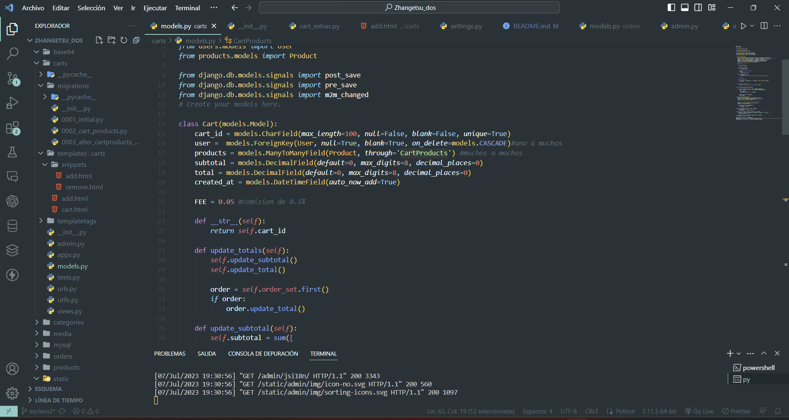
## navbar
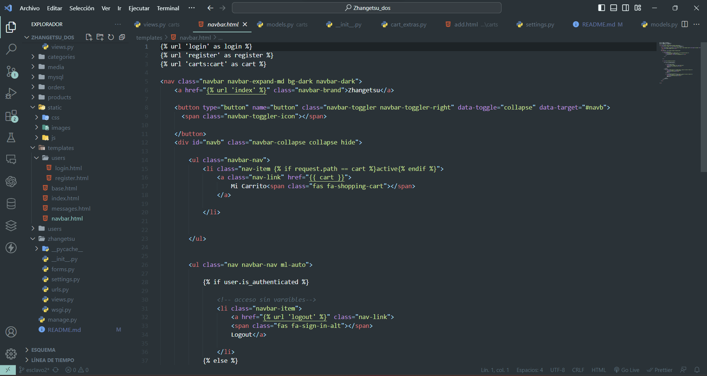
## views
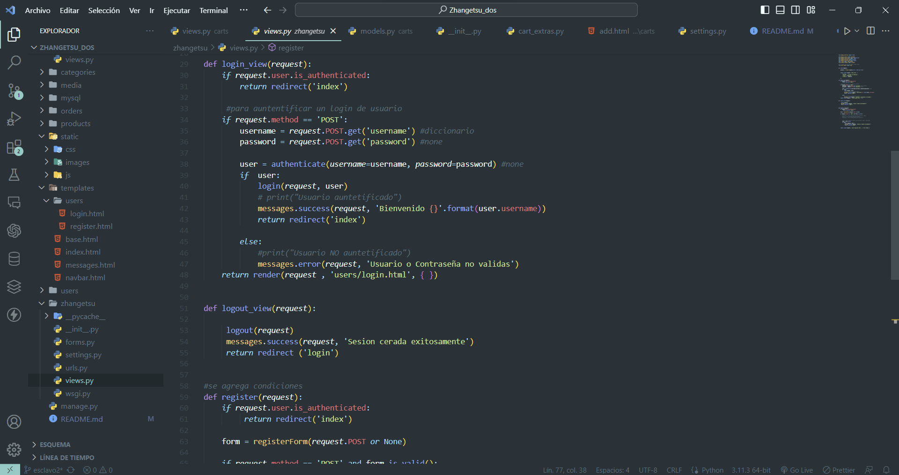
## template base
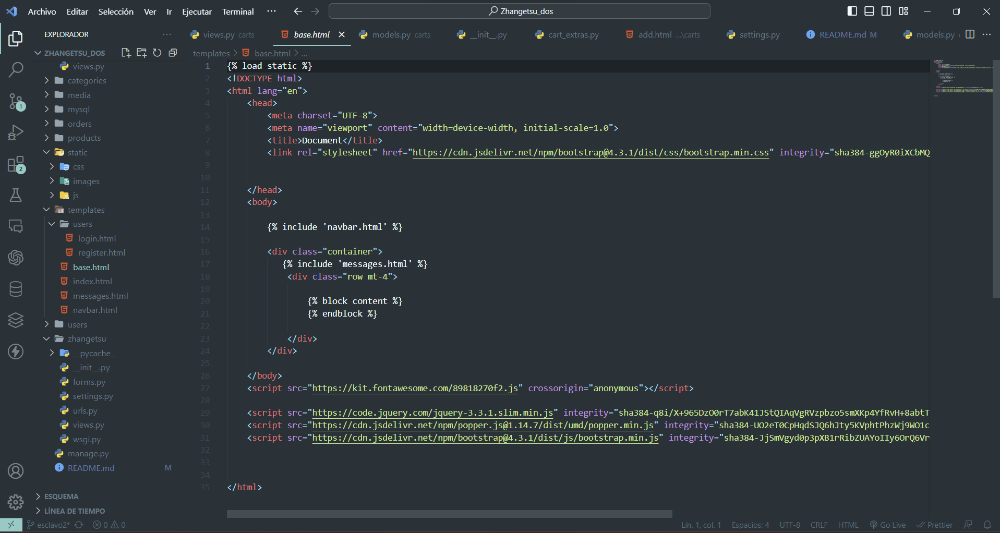
## Snippers

## adm users
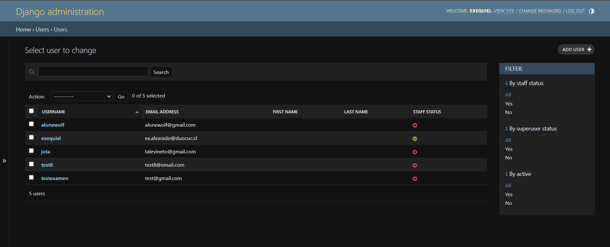
## adm products
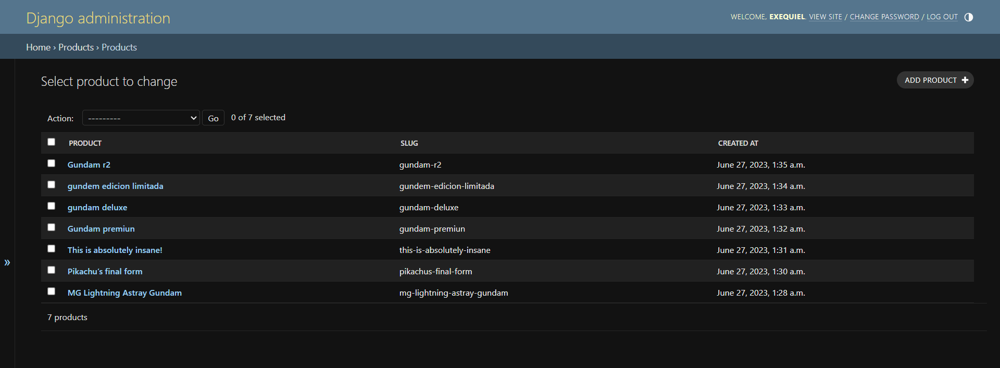
## panel adm django
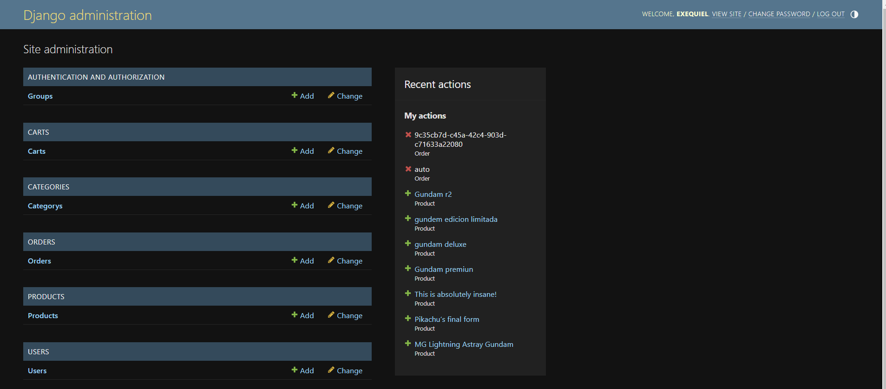

Gracias por ver mi obra de arte

[Exquiel Alvarado](https://www.exequiels.com) Mostando mi projecto.

